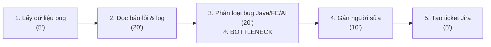
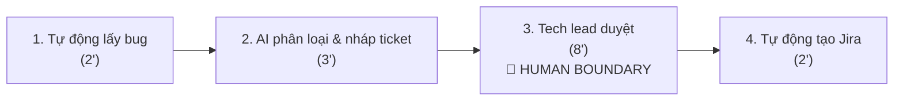
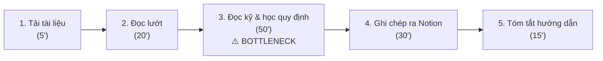
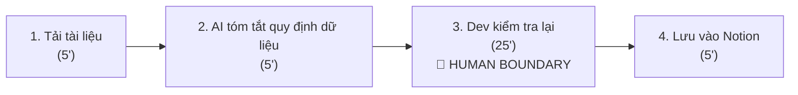
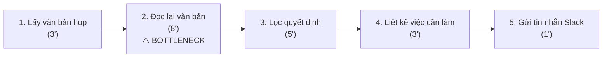
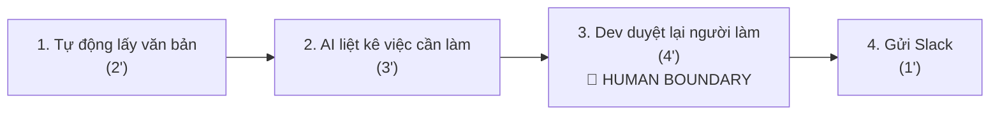

# 01 — Individual Problem Scan

> Điền theo Phase 1 + Phase 2 trong `01-worksheet.md`. Tự scan trước, dùng AI sau để phản biện. Không copy ví dụ Weekly Report.

## Thông tin cá nhân

- Họ và tên: Nguyễn Như Tài
- Mã học viên: 2A202602976
- Vai trò / bối cảnh (VD: sinh viên năm X, intern PM, ...): Tốt nghiệp đại học với role Frontend, sau đó đi làm backend 6 tháng và hiện tại là học viên của chương trình AI thực chiến tại Vinuni để tiếp cận lĩnh vực AI
- Công việc hằng tuần (3-5 gạch đầu dòng để soi problem):
1. Đọc và phân loại bug trong hệ thống Java Backend
2. Viết tài liệu mô tả kết nối hệ thống Backend cho các bộ phận liên quan khác
3. Đọc, tìm hiểu, học và tóm tắt tài liệu hướng dẫn mô hình AI để đưa tính năng AI vào hệ thống
4. List ra những công việc cần làm sau các cuộc họp
5. Kiểm tra và note lại thời gian phản hồi của chức năng sau khi tích hợp chức năng mới hoặc sửa lỗi.

---

## Phase 1 — Scan 5+ problems (tối thiểu 5, khuyến khích 8-10)

**Cách điền:** mỗi dòng = việc gì + ai chịu + đo bằng gì. Cột `Dấu hiệu thật` bắt buộc có số: mất bao lâu (bấm giờ mấy lần), mấy lần/tuần, bao nhiêu người gặp, log/ticket/quote nào.

| # | Lăng kính (Lặp lại / Tốn thời gian / AI có thể tốt hơn / Pain từ người khác) | Problem quan sát được | Ai chịu ảnh hưởng? | Dấu hiệu thật (số + bằng chứng) |
|---|---|---|---|---|
| 1 |Tốn thời gian |Đọc và phân loại bug trong hệ thống Java Backend thành ticket rõ ràng |Tech lead, Java Backend dev, Frontend dev và AI dev | Mất 45-60 phút/tuần (nhận 8-10 báo bug/tuần, đọc và phân loại mất ~5 phút/bug). |
| 2 |Tốn thời gian | Đọc, tìm hiểu, học và tóm tắt tài liệu hướng dẫn mô hình AI để biết cách đưa tính năng AI vào hệ thống Java Backend | Java Backend Dev| Mất 90-120 phút mỗi khi làm tính năng AI mới (thường 1-2 tuần đọc 1 tài liệu/docs dài).|
| 3 |Lặp lại |Liệt kê các việc cần làm và các quyết định về kỹ thuật sau mỗi buổi họp cập nhật tiến độ Backend & AI. | những thành viên trong team dự án | Mất 15-20 phút sau mỗi buổi họp 45 phút (họp 2 buổi/tuần = ~35 phút/tuần). Đôi khi có 1-2 công việc nhỏ bị trôi do không ghi chép lại ngay. |
| 4 | Pain từ người khác | Các bộ phận liên quan khác nhắn tin hỏi lại Java Backend Dev nhiều lần vì tài liệu mô tả kết nối Backend không ghi rõ trường hợp bị lỗi | Java Backend Dev, Bộ phận liên quan | Nhận 3-4 tin nhắn Slack/tuần hỏi "khi hệ thống Backend lỗi thì trả về dữ liệu gì?". Mất khoảng 25-30 phút/tuần nhắn tin giải thích lại. |
| 5 | Pain từ người khác | Các bộ phận liên quan khác không có dữ liệu mẫu (mock data Java Backend) để chạy thử trước khi hệ thống chính hoàn thành | Java Backend Dev, Bộ phận liên quan | Mất 30-45 phút mỗi khi bộ phận khác cần dữ liệu mẫu để chạy thử (~1 lần/tuần). Tự viết tay các chuỗi JSON dữ liệu mẫu trên Notion/Postman. |
| 6 | Lặp lại | Viết báo cáo công việc hàng ngày của Java Backend Dev (Daily Standup: hôm qua sửa lỗi/code gì, hôm nay làm gì) | Cá nhân Dev, Team Lead | Mất 5-10 phút/ngày (~30 phút/tuần). Ngày nào cũng phải mở lại lịch sử Git commit để nhớ hôm qua đã sửa file Java nào. |


> Gợi ý tự soi: tuần trước mất nhiều thời gian nhất vào việc gì? Việc gì hay trì hoãn? Người khác hay hỏi lại câu gì? Workflow nào ai cũng biết là chậm?

**AI đã dùng ở Phase 1 (nếu có):**
- Prompt đã hỏi: `Tôi làm Java Backend 6 tháng và đang học Vin AI. Tôi đã tự liệt kê danh sách công việc hằng tuần, hãy gợi ý thêm góc nhìn tham khảo và hỗ trợ trình bày lại câu từ cho mượt mà, dễ hiểu.`
- Ý dùng được: Chủ yếu tham khảo thêm góc nhìn phân loại công việc và nhờ AI hỗ trợ chỉnh sửa, trình bày lại câu từ cho mượt mà, mạch lạc hơn.
- Ý bỏ vì không phải pain thật: Bỏ các ý tưởng quá xa rời thực tế hoặc quá rườm rà không đúng với trải nghiệm công việc hằng tuần của bản thân.

**Self-check Phase 1:**
- [X] Đủ 5+ dòng, mỗi dòng có actor + số đo cụ thể
- [X] Dùng ít nhất 3/4 lăng kính
- [X] Không có dòng chung chung kiểu "mất nhiều thời gian"

---

## Phase 2 — Top 3 Problem Cards

### 2.1. Chọn top 3

Giữ bài nào: actor cụ thể, workflow vẽ được 3-7 bước, bottleneck ở 1 bước, impact đo được. Loại bài quá rộng.

| Rank | Problem (copy từ bảng scan) | Vì sao chọn (2-3 ý) | Điều còn chưa chắc |
|---|---|---|---|
| 1 | Đọc và phân loại bug trong hệ thống Java Backend thành ticket rõ ràng | Trực tiếp giải quyết điểm nghẽn phân loại lỗi cho các bên (Java BE, FE, AI dev). Bước đọc mô tả và kiểm tra log chiếm 50% thời gian. Kết quả đo lường rõ ràng (giảm từ 60' xuống 15'/tuần). | AI có phân biệt đúng lỗi do logic Java Backend hay do mô hình AI trả về kết quả sai không. |
| 2 | Đọc, tìm hiểu, học và tóm tắt tài liệu hướng dẫn mô hình AI để biết cách đưa tính năng AI vào hệ thống Java Backend | Bám sát bối cảnh đọc tài liệu khi làm tính năng AI mới. Các bước đọc và trích xuất quy định dữ liệu rất rõ ràng. Tiết kiệm thời gian thực tế (giảm từ 120' xuống 40'/lần). | AI có bỏ sót các điều kiện giới hạn dữ liệu quan trọng trong tài liệu hay không. |
| 3 | Liệt kê các việc cần làm và các quyết định về kỹ thuật sau mỗi buổi họp cập nhật tiến độ Backend & AI. | Vấn đề lặp lại hàng tuần của các thành viên trong team. Điểm nghẽn ở khâu đọc lại nội dung cuộc họp và lọc danh sách công việc. Thực tế dễ áp dụng (giảm từ 35' xuống 10'/tuần). | AI có gán nhầm người làm việc do lúc họp mọi người thảo luận nhanh hay không. |

### 2.2. Problem Cards chi tiết (lặp lại cho cả 3 cards)

---

#### Problem Card #1 — Đọc và phân loại bug trong hệ thống Java Backend thành ticket rõ ràng

```text
Problem 1 câu:
Tech lead mất 45-60 phút/tuần đọc 8-10 báo bug để phân loại rõ ràng cho Java Backend dev, Frontend dev và AI dev nhằm giao đúng người xử lý.

Actor:
Tech lead / Java Backend dev

Thời điểm / bối cảnh:
Cuối ngày làm việc hoặc trước buổi họp phân công công việc đầu tuần.

Current workflow 3-7 bước:
1. Mở danh sách báo bug gửi qua Google Form/Slack (5')
2. Đọc từng câu mô tả lỗi và kiểm tra thông tin log đính kèm (20')
3. Phân loại thủ công lỗi thuộc về Java Backend, Frontend hay AI Model (20')
4. Chọn mức độ ưu tiên và gán cho bạn Dev tương ứng sửa (10')
5. Tạo ticket công việc trên phần mềm Jira (5')

Bottleneck:
Bước 3 & 4 - Đọc các mô tả lủng củng và soi log để xác định chính xác bộ phận bị lỗi (chiếm 30 phút).

Impact:
Mất 45-60 phút/tuần; từng có lần gán nhầm bug làm các bên đùn đẩy nhau và trễ tiến độ sửa lỗi.

Success metric:
Giảm thời gian phân loại từ 60 phút xuống 15 phút/tuần; gán đúng người sửa > 85%; không gán nhầm bug.

Non-AI alternative:
Thêm ô chọn bắt buộc trên Form báo lỗi cho người báo tự chọn bộ phận bị lỗi.

AI hypothesis:
AI đọc câu mô tả bug & log -> Đề xuất bộ phận bị lỗi (Java BE/FE/AI), Mức độ ưu tiên & Nháp ticket -> Tech lead bấm duyệt 1 nút.

Quick gut:
[ ] No AI / process fix
[ ] Rule
[x] Workflow
[ ] Agent
[ ] Chưa biết
```

**Draft workflow Card #1:**

**CURRENT STATE — 60 phút**


**FUTURE STATE — 15 phút**


**Fallback:** Nếu AI không chắc chắn (độ tin cậy dưới 70%), ticket sẽ chuyển vào ô "Chờ duyệt thủ công" để Tech lead tự kiểm tra.

File đính kèm (nếu vẽ riêng): `01-individual-problem-scan-workflow-card-1.png`


---

#### Problem Card #2 — Đọc, tìm hiểu, học và tóm tắt tài liệu hướng dẫn mô hình AI để biết cách đưa tính năng AI vào hệ thống Java Backend


```text
Problem 1 câu:
Java Backend dev mất 90-120 phút mỗi khi có tính năng mới để đọc, tìm hiểu, học và tóm tắt tài liệu hướng dẫn mô hình AI nhằm đưa tính năng AI vào hệ thống Java Backend.

Actor:
Java Backend dev / Học viên AI

Thời điểm / bối cảnh:
Khi nhóm chuẩn bị đưa một tính năng AI mới vào hệ thống Java Backend (1-2 tuần/lần).

Current workflow 3-7 bước:
1. Tải tài liệu hướng dẫn hoặc bài báo về mô hình AI (5')
2. Đọc lướt phần giới thiệu và cách hoạt động chung (20')
3. Đọc kỹ, tìm hiểu và học đoạn quy định dữ liệu đầu vào, đầu ra và giới hạn của mô hình AI (50')
4. Trích xuất các lưu ý kỹ thuật vào trang ghi chú Notion (30')
5. Tóm tắt lại hướng dẫn để đưa tính năng AI vào hệ thống (15')

Bottleneck:
Bước 3 & 4 - Đọc kỹ, học và trích xuất các quy định dữ liệu kỹ thuật từ tài liệu tiếng Anh dài (chiếm 80 phút).

Impact:
Mất 90-120 phút/lần; nếu đọc sót quy định sẽ làm hệ thống Java Backend bị lỗi timeout khi chạy thực tế.

Success metric:
Giảm thời gian đọc và tóm tắt từ 120 phút xuống 40 phút/lần; trích xuất chính xác 100% điều kiện kỹ thuật.

Non-AI alternative:
Xem các đoạn code mẫu (Code sample) có sẵn trên mạng nếu bài toán phổ biến.

AI hypothesis:
AI đọc tài liệu -> Tóm tắt dạng danh sách: Dữ liệu đầu vào, Đầu ra, Giới hạn -> Dev xem lại và sử dụng.

Quick gut:
[ ] No AI / process fix
[ ] Rule
[x] Workflow
[ ] Agent
[ ] Chưa biết
```

**Draft workflow Card #2:**

**CURRENT STATE — 120 phút**


**FUTURE STATE — 40 phút**


**Fallback:** Nếu AI tóm tắt thiếu hoặc khó hiểu, Dev nhấp vào liên kết đính kèm để mở đúng trang tài liệu gốc xem lại.

File đính kèm: `01-individual-problem-scan-workflow-card-2.png`

---

#### Problem Card #3 — Liệt kê các việc cần làm và các quyết định về kỹ thuật sau mỗi buổi họp cập nhật tiến độ Backend & AI

```text
Problem 1 câu:
Java Backend dev mất 15-20 phút sau mỗi buổi họp 45 phút để liệt kê các việc cần làm và các quyết định về kỹ thuật cho những thành viên trong team dự án.

Actor:
Java Backend dev / Học viên AI

Thời điểm / bối cảnh:
Ngay sau các buổi họp nhóm cập nhật tiến độ kỹ thuật Backend & AI (thứ 3 và thứ 6 hàng tuần).

Current workflow 3-7 bước:
1. Tải bản ghi văn bản cuộc họp từ Google Meet (3')
2. Đọc lại nội dung cuộc họp 45 phút (8')
3. Lọc ra các quyết định kỹ thuật chính đã chốt (5')
4. Liệt kê các việc cần làm sau cuộc họp, ghi rõ người làm và hạn chốt (3')
5. Gửi tin nhắn tóm tắt vào nhóm Slack (1')

Bottleneck:
Bước 2 & 3 - Đọc lại văn bản họp và lọc ra đúng danh sách các quyết định kỹ thuật chính đã chốt (chiếm 13 phút).

Impact:
Mất 15-20 phút sau mỗi buổi họp (họp 2 buổi/tuần = ~35 phút/tuần); đôi khi có 1-2 công việc nhỏ bị trôi do không ghi chép lại ngay.

Success metric:
Giảm thời gian liệt kê việc từ 35 phút xuống 10 phút/tuần; 100% việc có tên người làm + hạn chốt; 0 công việc bị bỏ quên.

Non-AI alternative:
Cử 1 bạn trong nhóm vừa họp vừa liệt kê luôn vào trang Notion chung.

AI hypothesis:
AI đọc văn bản cuộc họp -> Liệt kê các việc cần làm và quyết định kỹ thuật dạng checklist (Việc gì - Ai làm - Hạn nào) -> Dev duyệt lại & gửi Slack.

Quick gut:
[ ] No AI / process fix
[ ] Rule
[x] Workflow
[ ] Agent
[ ] Chưa biết
```

**Draft workflow Card #3:**

**CURRENT STATE — 35 phút**


**FUTURE STATE — 10 phút**


**Fallback:** Nếu AI gán nhầm tên người làm, Dev chỉnh sửa lại trực tiếp trên bản nháp trước khi nhấn gửi tin nhắn.

File đính kèm: `01-individual-problem-scan-workflow-card-3.png`

---

### 2.3. Card muốn pitch nhất (chuẩn bị 2 phút)

**Card tôi muốn pitch nhất:**

```text
Problem Card #1 — Đọc và phân loại bug trong hệ thống Java Backend thành ticket rõ ràng
```


**Vì sao (2-3 câu: workflow gì, số đo gì, impact gì):**

```text
Bài toán này bám sát công việc thực tế nhận 8-10 báo bug/tuần. Quy trình 5 bước rất rõ ràng, giải quyết đúng điểm nghẽn phân loại bug cho các bộ phận (Tech lead, Java Backend dev, Frontend dev và AI dev), giúp giảm thời gian từ 60 phút xuống 15 phút/tuần và tránh gán nhầm bug.
```

**Câu hỏi tôi muốn nhóm challenge (1-2 câu hỏi đúng chỗ yếu):**

```text
Nếu câu mô tả báo bug của người dùng quá ngắn thì làm sao AI phân biệt được bug thuộc về Java Backend, Frontend hay AI Model? Làm thế nào để AI không đoán nhầm?
```

**AI phản biện Card (nếu có):**
- Điểm yếu AI chỉ ra: Người báo bug thường tả ngắn gọn nên AI dễ đoán nhầm giữa bug Java Backend và bug AI Model.
- Tôi sửa gì: Đưa ra điều kiện nếu câu tả quá mơ hồ, AI sẽ không tự phân loại mà gắn nhãn "Chờ duyệt thủ công" để Tech lead tự kiểm tra.

### Self-check nộp phần 01
- [x] Có 5+ problems + top 3 Cards đủ field
- [x] Mỗi Card có workflow trước/sau + bottleneck + metric + fallback
- [x] Đã chọn 1 card pitch + câu hỏi challenge
