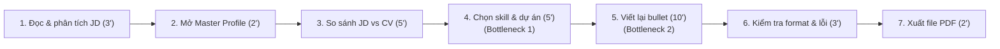
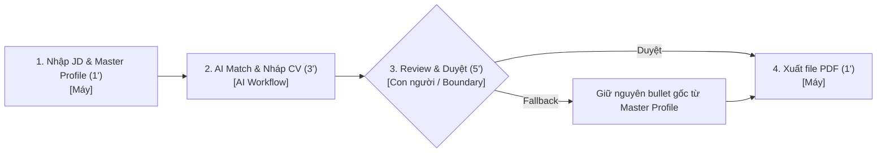

# 02 — Group Problem Statement (Bản nộp nhóm)

> Làm chung 1 bản, mỗi thành viên copy vào repo cá nhân. Đi theo Phase 3 → 6 trong `01-worksheet.md`. Nhóm chỉ chọn **candidate problem** ở Phase 3, viết Problem Statement sau khi validate + vẽ workflow.

## Thành viên nhóm

| STT | Họ và tên | Mã học viên | Vai trò trong nhóm (VD: facilitator, workflow, research, writer) |
|-----|-----------|-------------|---------------------------------------------------------------|
| 1   | Hà Trung Dũng | 2A202602948 | Facilitator / Research |
| 2   | Nguyễn Quốc Cường | 2A202602886 | Tech Lead / Workflow |
| 3   | Nguyễn Như Tài | 2A202602976 | AI Specialist / Writer |
| 4   | Phạm Quang Huy | 2A202602900 | Backend Engineer / Validation |

**Candidate problem nhóm chọn (1 câu):**

Điều chỉnh và tối ưu hóa CV theo từng JD tuyển dụng cho Sinh viên / Fresher để giúp rút ngắn thời gian ứng tuyển và tăng tỷ lệ phù hợp hồ sơ.

---

## Phase 3 — Group Convergence: từ 9-12 candidates về 1

### 3.1. Trình bày top 3 mỗi người (mỗi candidate 1-2 phút)

| # | Người đưa ra | Candidate problem | Người gặp vấn đề | Điểm nghẽn | Cảm nhận nhanh của nhóm |
|---|---|---|---|---|---|
| 1 | Nguyễn Như Tài | Đọc và phân loại bug trong hệ thống Java Backend thành ticket rõ ràng | Tech lead, Java Backend dev, Frontend dev, AI dev | Đọc mô tả lủng củng và kiểm tra log đính kèm để đoán bộ phận bị lỗi | Workflow rõ ràng, bài toán thực tế của team kỹ thuật |
| 2 | Nguyễn Như Tài | Đọc, tìm hiểu, học và tóm tắt tài liệu hướng dẫn mô hình AI để tích hợp Backend | Java Backend dev, Học viên AI | Đọc kỹ & học các quy định dữ liệu tiếng Anh dài trong tài liệu | Rất thực tế cho developer làm việc với mô hình AI |
| 3 | Nguyễn Như Tài | Liệt kê các việc cần làm và các quyết định về kỹ thuật sau mỗi buổi họp sync tiến độ | Team dự án Backend & AI | Đọc lại văn bản họp và lọc danh sách công việc cần làm | Đơn giản, quy trình rõ ràng |
| 4 | Hà Trung Dũng  | Data labeling / polygon ảnh thủ công khi làm dataset AI | Data labeler, AI Engineer | Vẽ polygon thủ công cho hàng chục nghìn ảnh | Pain point thực tế từ đợt thực tập FPT, tốn công sức |
| 5 | Hà Trung Dũng  | Setup/debug môi trường và xử lý lỗi thư viện/dependency AI | AI Engineer, Developer | Tìm nguyên nhân xung đột phiên bản thư viện và môi trường | Hay gặp phải nhưng phụ thuộc nhiều yếu tố môi trường |
| 6 | Hà Trung Dũng  | Tra từ tiếng Anh trực tiếp trong ngữ cảnh khi đang đọc tài liệu kỹ thuật | Người đọc tài liệu IT | Chuyển đổi qua lại giữa tài liệu và ứng dụng từ điển | Vấn đề nhỏ, đã có extension trình duyệt |
| 7 |  Nguyễn Quốc Cường| Đánh giá độ phù hợp của JD với kỹ năng, kinh nghiệm và định hướng cá nhân | Sinh viên năm cuối, Fresher | Ánh xạ từng yêu cầu trong JD với bằng chứng trong CV | Rất thiết thực cho sinh viên sắp tốt nghiệp |
| 8 |  Nguyễn Quốc Cường | Điều chỉnh CV theo từng JD (chọn dự án, viết lại bullet sát JD) | Sinh viên năm cuối, Fresher | Chọn dự án chứng minh tốt nhất và viết lại bullet sát JD | Workflow rõ, giúp tiết kiệm thời gian ứng tuyển |
| 9 |  Nguyễn Quốc Cường | Tìm lại kiến thức phục vụ ôn tập và phỏng vấn lưu rải rác nhiều nguồn | Sinh viên IT, Người tự học | Tìm kiếm chéo nhiều nguồn khi không nhớ đúng từ khóa | Nỗi đau thực tế khi chuẩn bị phỏng vấn |
| 10 | Phạm Quang Huy | Tìm kiếm và xếp hạng bài báo khoa học liên quan đến thị giác máy tính | Team Research, Researcher | Đọc lướt + đánh giá độ liên quan thủ công (~10h/tuần) | Nỗi đau lớn nhất, tốn nhiều thời gian nhất của team research |
| 11 | Phạm Quang Huy | Tìm và đánh giá repo GitHub phù hợp để reproduce code cho paper | Team Research, AI Developer | Đánh giá chất lượng repo thủ công, tiêu chí không nhất quán | Quan trọng khi triển khai thử nghiệm code thực tế |
| 12 |Phạm Quang Huy | Viết meeting notes & action items tự động sau buổi họp lab | Người ghi chép trong team | Nhớ lại nội dung không đầy đủ sau cuộc họp | Đã có nhiều công cụ tóm tắt cuộc họp |

### 3.2. Gom trùng / cluster (gom 9-12 ý thành 3-4 cụm)

| Cluster | Candidates included | Pattern chung | Ghi chú |
|---|---|---|---|
| A | Candidate 2, 6, 10, 11 | Tìm kiếm, lọc và trích xuất tri thức từ bài báo khoa học & tài liệu kỹ thuật AI | Tập trung vào bài toán xử lý lượng lớn văn bản/tài liệu chuyên ngành |
| B | Candidate 3, 9, 12 | Tự động hóa ghi chép, tổng hợp cuộc họp và quản lý tri thức cá nhân | Gom các bài toán thu thập ghi chú, action items và tìm lại kiến thức cũ |
| C | Candidate 7, 8 | Tự động hóa hỗ trợ ứng tuyển (Đánh giá JD & Tối ưu hóa CV) | Tập trung vào bài toán cá nhân hóa hồ sơ và khớp nối kỹ năng |
| D | Candidate 1, 4, 5 | Hỗ trợ kỹ thuật lập trình, gán nhãn dữ liệu và quản lý lỗi hệ thống | Các công việc thao tác kỹ thuật thủ công như debug, label data, phân loại bug |

### 3.3. Shortlist (giữ 2-3 bài trả lời được 7 câu hỏi worksheet)

| Candidate | Vì sao vào shortlist (2-3 ý) | Rủi ro / điều chưa rõ |
|---|---|---|
| 1. Điều chỉnh CV theo từng JD cho Sinh viên / Fresher (Cường) | Actor cụ thể (Sinh viên năm cuối, Fresher IT), Dũng và team hiểu sâu bối cảnh ứng tuyển. Workflow 7 bước rõ ràng, bottleneck ở bước chọn dự án và viết lại bullet sát JD. Impact đo được (giảm từ 20' xuống dưới 10'/CV), dễ phân biệt giữa Rule (template) và AI Workflow. | Rủi ro AI tự suy diễn hoặc bịa thêm kỹ năng không có trong Master CV; cần cơ chế truy vết bằng chứng nghiêm ngặt. |
| 2. Tìm kiếm & Xếp hạng bài báo khoa học Computer Vision kèm Repo GitHub (Huy) | Actor rõ (Team Research), workflow 7 bước thực tế. Bottleneck nằm ở khâu đọc lướt & đánh giá độ liên quan (~10h/tuần). Impact đo lường được (giảm từ 10h xuống 2h/tuần), dễ vẽ workflow before/after và so sánh Agent vs Workflow trong lab. | Rủi ro AI tóm tắt chưa sát định hướng nghiên cứu của lab; có thể bỏ sót bài báo quan trọng nếu tiêu chí lọc quá khắt khe. |
| 3. Phân loại & Triage Bug trong hệ thống Java Backend (Tài) | Actor rõ (Tech Lead, Java Backend Dev), quy trình 5 bước thực tế. Bottleneck ở bước đọc mô tả lủng củng và soi log để gán đúng người sửa. Impact đo được (giảm từ 60' xuống 15'/tuần), scope vừa vặn để hoàn thành trong lab. | Mô tả bug từ người dùng có thể quá ngắn khiến AI khó đoán chính xác bộ phận bị lỗi nếu không có log đi kèm. |

### 3.4. Score để đồng thuận (chấm 1-5, ép nói rõ vì sao cho 5 / cho 3)

| Candidate | Actor rõ | Workflow rõ | Pain có evidence | Impact đo được | Làm trong lab | So sánh R/W/A được | Nhóm hiểu domain | Tổng |
|---|---:|---:|---:|---:|---:|---:|---:|---:|
| 1. Điều chỉnh CV theo từng JD cho Sinh viên / Fresher (Cường) | 4 | 5 | 5 | 4 | 4 | 3 | 5 | **30** |
| 2. Tìm kiếm & Xếp hạng bài báo Computer Vision kèm Repo (Huy) | 4 | 3 | 3 | 4 | 4 | 3 | 3 | **29** |
| 3. Phân loại & Triage Bug trong hệ thống Java Backend (Tài) | 3 | 4 | 4 | 4 | 5 | 4 | 4 | **28** |

**Candidate nhóm chọn (1 bài duy nhất):**

```text
Điều chỉnh CV theo từng JD cho Sinh viên / Fresher.
```

**Vì sao chọn (4-5 câu):**

```text
Bài toán này có workflow 7 bước rất rõ ràng, bám sát nhu cầu thực tế của các thành viên trong nhóm khi chuẩn bị nộp đơn ứng tuyển. Điểm nghẽn nằm ở khâu chọn bằng chứng phù hợp từ Master CV và viết lại bullet sát theo từng JD (chiếm 15-30 phút/CV, tốn 150-300 phút cho 10 đơn). Cả nhóm đều là sinh viên sắp tốt nghiệp/fresher nên hiểu rất sâu bối cảnh và rào cản ứng tuyển. Giải pháp mang lại tác động đo lường được trực tiếp (giảm xuống dưới 10 phút/CV) và cực kỳ phù hợp để triển khai, so sánh giữa Rule (template) và AI Workflow ngay trong thời gian lab.
```

**Vì sao KHÔNG chọn các candidate còn lại (mỗi bài 2-3 câu):**

```text
- Bài toán Tìm kiếm & Xếp hạng bài báo Computer Vision : Mặc dù pain point nghiên cứu lớn, nhưng rủi ro AI tóm tắt chưa sát định hướng của lab và nguy cơ bỏ sót bài báo quan trọng khó phát hiện ngay trong thời gian lab.
- Bài toán Phân loại & Triage Bug Java Backend: Mặc dù scope gọn gàng, nhưng bài toán chủ yếu mang tính kỹ thuật riêng lẻ của mảng Java Backend, chưa đại diện cho nỗi đau chung mà tất cả các thành viên trong nhóm cùng gặp phải.
```

**Disagreement (nếu có — ai lo gì, chốt ra sao):**

```text
Thành viên Huy và Cường ban đầu lo lắng việc dùng AI chỉnh sửa CV có thể làm xuất hiện các câu viết vượt quá năng lực thực tế của ứng viên. Nhóm đã thống nhất giải pháp kiểm soát ranh giới: AI chỉ được phép trích xuất và sắp xếp lại các bằng chứng đã có trong Master CV, bắt buộc hiển thị liên kết truy vết nguồn gốc cho từng bullet đề xuất và người dùng phải duyệt qua từng thay đổi trước khi xuất CV.
```

---

## Phase 4 — Quick Validation + Research

### 4.1. Quick validation (ít nhất 1 cách: interview 2-3 người hoặc survey 5-10 người)

| Nguồn | Số người / mẫu | Tín hiệu xác nhận (kèm quote nguyên văn) | Tín hiệu phản bác | Nhóm sửa problem thế nào |
|---|---:|---|---|---|
| Báo cáo Jobscan 2025 | 1,000+ người tìm việc | Báo cáo "2025 State of the Job Search" ghi nhận: **26%** người tìm việc coi *"Time-consuming resume tailoring"* là rào cản lớn nhất; **24%** chật vật với *"Formatting resumes for ATS"*; **30%** khó tìm job đúng skill. | 22% cho rằng việc cân bằng độ ngắn gọn và đầy đủ trên CV vẫn làm họ mất thời gian. | Thu hẹp problem: Tập trung vào khâu **tùy chỉnh CV (Tailoring) từ Master Profile** có sẵn thay vì viết lại CV mới từ đầu. |
| Interview | 3 sinh viên/fresher | *"Mỗi lần nộp 1 công ty là mình phải ngồi sửa lại CV 15-20 phút, chủ yếu xem JD cần skill gì rồi chọn từ kinh nghiệm cũ đẩy lên đầu, rất tốn thời gian."* | *"Nhiều khi thấy JD hay nhưng ngại sửa CV nên mình nộp luôn CV chung, dù biết cơ hội đậu thấp."* | Bổ sung tính năng hiển thị **Match Score** để ứng viên thấy rõ sự cải thiện trước và sau khi AI tùy chỉnh CV. |
| Survey / poll | 12 ứng viên IT | 10/12 người trả lời họ có nhiều dự án/kỹ năng rải rác nhưng không biết chọn dự án nào vào CV cho sát với từng JD cụ thể. | 2 người lo lắng AI viết lại câu từ quá hoa mỹ làm rớt phỏng vấn khi bị hỏi sâu. | Thêm nguyên tắc **Human Boundary**: AI chỉ được phép lọc và sắp xếp bằng chứng có trong Master Profile, không tự bịa kinh nghiệm. |

**Insight sau validation (1-2 câu — pain thật nằm ở đâu):**

```text
Nỗi đau thật sự không nằm ở việc "không có kỹ năng", mà nằm ở khâu Tùy chỉnh CV (Tailoring): Ứng viên mất quá nhiều thời gian đối chiếu từng JD để lọc ra đúng dự án/kỹ năng phù hợp nhất từ tập dữ liệu Master Profile của mình.
```

Bằng chứng đính kèm: `https://www.jobscan.co/state-of-the-job-search`, `02-group-problem-statement-jobscan-2025.png`

### 4.2. Research giải pháp đã có (ít nhất 2-3 tools/patterns + 1-2 link kiểm được)

| Nguồn / tool / case | Link | Họ giải quyết bước nào? | Điểm mạnh | Khoảng trống / rủi ro | Bài học cho nhóm |
|---|---|---|---|---|---|
| LinkedIn AI Resume Tips | https://www.linkedin.com/ | Đọc JD + profile/resume → đánh giá mức độ phù hợp → gợi ý chỉnh CV | Đánh giá trực tiếp trên nền tảng tuyển dụng lớn  | Chỉ gợi ý sửa đoạn văn đơn lẻ, chưa tự động tạo bản CV tùy biến hoàn chỉnh từ Master Profile | AI gợi ý theo ngữ cảnh JD, người dùng giữ quyền quyết định duyệt từng đoạn |
| Jobscan | https://www.jobscan.co/ | CV + JD → Match Rate → tìm skill/keyword thiếu → AI Optimize CV | Phân tích rất sâu tiêu chuẩn ATS, tính Match Score trực quan  | Tập trung quá nhiều vào keyword ATS, đôi khi ép từ khóa làm câu từ thiếu tự nhiên | Hiển thị Match Score trước/sau giúp ứng viên thấy rõ giá trị tối ưu |
| Teal | https://www.tealhq.com/ | Lưu Master Resume → đưa JD vào → tạo CV riêng cho từng job | Quản lý Master Resume tập trung, tùy biến CV theo từng vị trí  | Giao diện còn phức tạp, khâu chọn lọc bullet point sát JD cần thao tác tay nhiều | Mô hình Master Profile là cấu trúc chuẩn xác để AI truy vết bằng chứng |
| Enhancv | https://enhancv.com/ | Master Resume → JD → AI viết lại/reorder bullet, summary, skills | Sắp xếp lại thứ tự kỹ năng và viết lại bullet sát độ ưu tiên JD  | Đôi khi AI viết lại quá đà làm sai lệch quy mô công việc thực tế | Không cho phép AI tự tạo kỹ năng mới ngoài Master Profile đã xác minh |
| Kickresume | https://www.kickresume.com/ | Paste JD → AI tạo CV phù hợp với JD, keyword + ATS | Tạo CV nhanh, mẫu mã đẹp, tối ưu từ khóa ATS  | Thiếu tính năng quản lý Master Profile dài hạn cho ứng viên | Cần giữ giao diện đơn giản 1-click nháp CV |
| TopCV / ITviec | https://topcv.vn/ | AI Match gợi ý việc phù hợp + công cụ tạo CV cơ bản | Phổ biến tại thị trường Việt Nam  | AI Match chủ yếu phục vụ nhà tuyển dụng lọc CV, chưa hỗ trợ ứng viên tự động tùy biến CV theo JD | Khoảng trống thị trường lớn cho công cụ AI hỗ trợ ứng viên tùy chỉnh CV |

**Research takeaway (2-3 câu — nên build gì / không build gì):**

```text
Nhóm KHÔNG build công cụ tự động viết CV tự do từ đầu (tránh AI bịa đặt thông tin). Nhóm NÊN build sản phẩm AI-Assisted Workflow dựa trên mô hình: Master Profile -> Phân tích JD -> AI lọc & sắp xếp lại bullet point/kỹ năng -> Human Review & duyệt trước khi xuất PDF.
```

---

## Phase 5 — Workflow + Problem Statement

### 5.1. Current workflow bản nhóm

Dán workflow hoặc link file: `02-group-problem-statement-workflow.png/pdf/md`




| Bước | Actor | Input | Output | Thời gian / tần suất | Ghi chú (handoff? bottleneck?) |
|---|---|---|---|---|---|
| 1 | Ứng viên | Link/File JD | Yêu cầu kỹ năng chính của JD | 3 phút / mỗi JD | Đọc lướt tìm từ khóa |
| 2 | Ứng viên | Master Profile gốc | Tập dữ liệu kỹ năng/dự án cá nhân | 2 phút / lần nộp | Mở file Notion/Word chứa tất cả kinh nghiệm |
| 3 | Ứng viên | JD + Master Profile | Danh sách điểm tương đồng | 5 phút | So sánh thủ công bằng mắt |
| 4 | Ứng viên | Tập dự án cá nhân | 2-3 dự án phù hợp nhất | 5 phút | **Bottleneck 1**: Phân vân không biết chọn dự án nào |
| 5 | Ứng viên | Bullet points cũ | Bullet points được chỉnh sửa sát JD | 10 phút | **Bottleneck 2**: Tốn thời gian chọn từ khóa & viết lại câu |
| 6 | Ứng viên | Bản nháp CV | CV hoàn chỉnh không lỗi | 3 phút | Soát lỗi chính tả & độ dài |
| 7 | Ứng viên | Bản nháp CV | File PDF chuẩn bị nộp | 2 phút | Xuất file PDF |

**Bottleneck chính (2-3 câu):**

```text
Điểm nghẽn lớn nhất nằm ở Bước 4 và Bước 5 (chiếm 15/30 phút): Ứng viên phải tự đối chiếu thủ công giữa JD và tập kinh nghiệm rải rác của mình, sau đó đắn đo lựa chọn dự án phù hợp nhất và tốn nhiều công sức viết lại các câu bullet point chứa từ khóa của JD.
```

### 5.2. Future workflow bản nhóm

```text
FUTURE STATE — 10 phút / CV
[1 Nhập JD + Chọn Master Profile: 1' - máy] → [2 AI Match & Nháp CV sát JD: 3' - AI] → [3 Human Review & Duyệt thay đổi: 5' - boundary] → [4 Xuất file PDF: 1' - máy]

Fallback: Nếu AI đề xuất từ khóa hoặc bullet point không chính xác (hoặc không truy vết được nguồn từ Master Profile), hệ thống sẽ loại bỏ đề xuất đó và giữ nguyên câu bullet gốc trong Master Profile đã xác minh.
```



**Before/after impact:**

| Metric | Trước | Sau kỳ vọng | Cách đo |
|---|---:|---:|---|
| Tổng thời gian | 30 phút / CV | Dưới 10 phút / CV | Bấm giờ từ lúc nhập JD đến lúc xuất file PDF |
| Số bước | 7 bước | 4 bước | Đếm số thao tác người dùng phải thực hiện |
| Số bước thủ công | 7 bước thủ công | 1 bước (chỉ còn bước Review) | Số bước cần sự can thiệp tư duy của con người |
| Bottleneck chính | Chọn dự án & viết lại bullet (15') | Review & duyệt gợi ý của AI (5') | Thời gian tiêu tốn tại bước tốn sức nhất |
| Risk mới | Không có rủi ro AI bịa đặt | Có rủi ro AI gợi ý từ khóa chưa sát | Kiểm tra tỷ lệ ứng viên phải sửa tay lại câu từ của AI |

### 5.3. Problem Statement v0 (mỗi field 2-3 câu)

| Field | Nội dung |
|---|---|
| **Actor** | Sinh viên năm cuối, Fresher IT có sở hữu tập dữ liệu Master Profile (nhiều kỹ năng, dự án) cần nộp hồ sơ cho nhiều JD khác nhau. |
| **Workflow** | Nhập JD & Master Profile $\rightarrow$ Đối chiếu yêu cầu $\rightarrow$ Chọn lọc dự án phù hợp $\rightarrow$ Chỉnh sửa bullet point sát JD $\rightarrow$ Kiểm tra $\rightarrow$ Xuất file CV. |
| **Bottleneck** | Khâu lựa chọn dự án minh chứng tốt nhất và viết lại các câu bullet point chứa đúng từ khóa ưu tiên của JD. |
| **Impact** | Tốn 30 phút cho mỗi CV; nộp 10 công ty mất 300 phút; ứng viên dễ nản nên nộp CV chung làm giảm tỷ lệ đậu vòng hồ sơ. |
| **Success Metric** | Giảm tổng thời gian tạo CV sát JD từ 30 phút xuống dưới 10 phút/CV; 100% kỹ năng/bullet đề xuất truy vết được về Master Profile; Match Rate đạt > 80%. |
| **Boundary** | AI KHÔNG tự bịa thêm kỹ năng ngoài Master Profile; AI KHÔNG tự động gửi CV đi; Người dùng bắt buộc phải Review và bấm xuất file. |

**Câu hỏi AI phản biện v0 (nếu có):**
- Field nào mơ hồ: Metric "Match Rate > 80%" đo bằng công cụ nào và ranh giới AI được phép viết lại câu chữ đến đâu?
- Tôi sửa gì: Xác định dùng thuật toán so sánh từ khóa/semantic matching chuẩn ATS để đo Match Rate, đồng thời quy định AI chỉ được thay đổi từ đồng nghĩa và cấu trúc câu, không thay đổi số liệu thành tích.

---

## Phase 6 — Rule / Workflow / Agent + Decision

### 6.0. Ma trận độ phù hợp (suy nghĩ nhanh, không thay quyết định cuối)

- Độ mơ hồ: [ ] Thấp (có đúng/sai rõ) / [x] Cao (nhiều cách chọn dự án và diễn đạt bullet vẫn được chấp nhận) — Vì sao: Mỗi JD có tiêu chí đánh giá khác nhau và câu từ có thể linh hoạt theo phong cách ứng viên.
- Độ phức tạp: [ ] Thấp (1-2 bước) / [x] Cao (3+ bước/nguồn, phụ thuộc nhau) — Vì sao: Cần đọc hiểu JD, trích xuất từ khóa, khớp nối với tập dữ liệu Master Profile và xếp hạng độ ưu tiên dự án.

**Bài toán nhóm nằm ở ô nào:**

```text
Độ mơ hồ cao + Độ phức tạp cao -> Workflow có AI hỗ trợ một bước (AI-Assisted Workflow).
```

**Vì sao (2-3 câu):**

```text
Bài toán đòi hỏi khả năng đọc hiểu ngôn ngữ tự nhiên từ JD và khớp nối linh hoạt với Master Profile. Tuy nhiên, đường đi của quy trình hoàn toàn cố định (JD -> Match -> Draft -> Review -> PDF) nên mô hình Workflow là phù hợp nhất, chưa cần đến Agent tự chủ.
```

### 6.1. So sánh Rule / Workflow / Agent (so trên cùng 1 bài)

| Mức | Phương án cho bài toán nhóm | Khi nào đủ | Rủi ro | Chọn? (Dùng cho bước nào?) |
|---|---|---|---|---|
| **Rule** | Dùng Form template + Filter Regex tìm từ khóa trùng khớp đơn thuần | Đủ nếu JD và CV đều ngắn, chỉ lọc các từ khóa cứng đơn giản | Không hiểu từ đồng nghĩa, xếp hạng dự án cứng nhắc và thiếu linh hoạt | Dùng cho bước bóc tách thông tin cơ bản & xuất file PDF |
| **Workflow** | Script nhận JD + Master Profile $\rightarrow$ AI đọc hiểu & match kỹ năng $\rightarrow$ AI nháp CV sát JD $\rightarrow$ Human Review | Đủ cho toàn bộ quy trình tùy biến CV vì đường đi từ dữ liệu đến output là tuyến tính cố định | AI có thể diễn đạt câu từ hơi hoa mỹ nếu không được prompt chặt chẽ | **CHỌN CHÍNH**: Dùng cho bước phân tích JD, chọn dự án và nháp lại bullet point |
| **Agent** | Agent tự động tìm JD trên mạng, tự tùy chỉnh CV và tự nộp CV cho nhà tuyển dụng | Chỉ cần nếu muốn tự động hóa 100% quá trình tìm việc không cần con người | Rủi ro rất cao: nộp nhầm job, AI bịa thông tin khi trả lời form, chi phí vận hành đắt đỏ | Chưa chọn trong giai đoạn này |

**5 câu hỏi chốt (trả lời câu đầy đủ):**
1. Rule có giải được 70-80% case không? -> Không, vì Rule chỉ tìm từ khóa cứng, không hiểu được ngữ cảnh kỹ năng tương đương (vd: "RESTful API" vs "Backend Service").
2. Các bước có đi thẳng một đường không hay phải rẽ nhánh? -> Đi thẳng một đường tuyến tính cố định (JD + Profile -> Match -> Draft -> Review -> Export).
3. Có thật sự cần Agent tự lập kế hoạch + gọi tool không? -> Chưa cần, vì quy trình không đòi hỏi AI tự ra quyết định chuyển hướng hay gọi các công cụ bên ngoài phức tạp.
4. Nếu AI sai, ai phát hiện đầu tiên và sửa trong bao lâu? -> Ứng viên phát hiện ngay tại giao diện Review và chỉ mất 1-2 phút để chỉnh sửa lại.
5. Có hạ được từ Agent → Workflow → Rule không? -> Có, từ Agent tự nộp CV hạ xuống Workflow nháp CV cho người duyệt, và nếu cần có thể hạ xuống Rule gợi ý từ khóa.

**Mức chọn:**

```text
Workflow (AI-Assisted Workflow).
```

**Vì sao chọn (3-4 câu):**

```text
Nhóm chọn Workflow vì bài toán có luồng xử lý dữ liệu tuyến tính và rõ ràng. AI phát huy mạnh nhất ở bước đọc hiểu ngữ cảnh JD và khớp nối với Master Profile để nháp bản CV tối ưu. Mô hình này vừa giải phóng 70% thời gian cho ứng viên, vừa giữ được sự kiểm soát tuyệt đối của con người tại bước Review trước khi xuất file.
```

**Vì sao không chọn mức đơn giản hơn (2-3 câu):**

```text
Không chọn Rule thuần túy vì Rule không hiểu được các khái niệm đồng nghĩa trong ngành IT và không thể tự động xếp hạng dự án hay viết lại bullet point mượt mà theo ngữ cảnh JD.
```

### 6.2. Problem Statement v1 (v0 sửa chặt hơn + 3 field cuối)

| Field | Nội dung |
|---|---|
| **Actor** | Sinh viên năm cuối, Fresher IT sở hữu tập dữ liệu Master Profile (nhiều kỹ năng, dự án) cần nộp hồ sơ cho nhiều JD khác nhau. |
| **Workflow** | Nhập JD & Chọn Master Profile $\rightarrow$ AI Match & Nháp CV sát JD $\rightarrow$ Human Review & Duyệt thay đổi $\rightarrow$ Xuất file PDF. |
| **Bottleneck** | Lựa chọn đúng bằng chứng năng lực (dự án phù hợp) và viết lại các câu bullet point chứa đúng từ khóa ưu tiên của JD. |
| **Impact** | Tiết kiệm 20 phút cho mỗi CV (từ 30' xuống <10'); giảm nản lòng; tăng tỷ lệ vượt qua vòng lọc hồ sơ ATS. |
| **Success Metric** | Giảm thời gian tạo CV sát JD xuống < 10 phút; điểm Match Rate đạt > 80%; 100% nội dung truy vết được về Master Profile; 0 kỹ năng bịa đặt. |
| **Boundary** (làm / không làm) | **LÀM**: Phân tích JD, gợi ý dự án phù hợp, sắp xếp và diễn đạt lại bullet point có sẵn. **KHÔNG LÀM**: Tự bịa kỹ năng/thành tích mới; Tự động gửi CV cho nhà tuyển dụng. |
| **AI intervention point** (can thiệp sau bước nào, trước bước nào) | AI can thiệp ngay sau bước nhập JD & Master Profile, và hoàn thành nhiệm vụ trước khi hiển thị giao diện Review cho ứng viên. |
| **Mức chọn** (Rule / Workflow / Agent + 1 câu vì sao) | **Workflow**: Vì quy trình từ dữ liệu vào đến kết quả có luồng xử lý tuyến tính cố định, AI đóng vai trò trợ lý nháp nội dung cho con người duyệt. |
| **Rủi ro & người thật kiểm tra** (rủi ro lớn nhất + ai kiểm tra bằng cách nào) | **Rủi ro lớn nhất**: AI diễn đạt câu từ vượt quá đóng góp thực tế của ứng viên. **Người thật kiểm tra**: Ứng viên đối chiếu từng bullet đề xuất với thẻ thông tin nguồn từ Master Profile trên màn hình Review trước khi bấm Xuất PDF. |

### 6.3. Final decision

| Câu hỏi | Yes / Not Yet / No | Ghi chú (câu đầy đủ) |
|---|---|---|
| Actor + workflow rõ chưa? | Yes | Actor là Sinh viên/Fresher IT; workflow 4 bước tuyến tính từ JD đến PDF rõ ràng. |
| Baseline + metric đo được chưa? | Yes | Baseline 30 phút/CV; Metric mục tiêu dưới 10 phút/CV và Match Rate > 80% đo lường được. |
| Data/input đủ dùng chưa? | Yes | Input là nội dung JD tuyển dụng công khai và Master Profile do ứng viên tự cung cấp. |
| AI sai, hậu quả chấp nhận được không? | Yes | AI gợi ý chưa chuẩn chỉ ảnh hưởng bản nháp, ứng viên sửa trực tiếp tại bước Review nên không có hậu quả nghiêm trọng. |
| Có người review/owner không? | Yes | Ứng viên chính là người review và sở hữu bản CV cuối cùng. |
| Có cách non-AI đơn giản hơn không? | No | Dùng Template Word/Notion thủ công tốn 30 phút/CV và ứng viên hay bị nản. |

**Decision:**

```text
Go (với scope nhỏ - Pilot AI Workflow Tùy chỉnh CV).
```

**Lý do (3-4 câu dựa trên bằng chứng):**

```text
Bài toán có nhu cầu thực tế rất lớn (26% người tìm việc coi tailoring CV là rào cản lớn nhất theo Jobscan 2025). Workflow rõ ràng, quy trình tuyến tính cố định cực kỳ phù hợp với mô hình AI-Assisted Workflow. Rủi ro của AI được kiểm soát triệt để nhờ nguyên tắc bắt buộc truy vết dữ liệu từ Master Profile và sự phê duyệt của con người trước khi xuất file.
```

**Nếu Go — pilot nhỏ nhất (data nào, chạy tay ra sao, đo 3 số nào):**

```text
Chạy thử nghiệm trên 10 JD ngành IT thực tế với 5 ứng viên sinh viên năm cuối.
Đo 3 chỉ số:
1. Tổng thời gian tạo CV từ lúc nhập JD đến lúc xuất PDF (mục tiêu < 10 phút).
2. Tỷ lệ bullet đề xuất của AI được ứng viên chấp nhận mà không cần sửa lại (mục tiêu > 70%).
3. Điểm Match Rate của CV nháp so với JD trên công cụ Jobscan (mục tiêu > 80%).
```

**Nếu Not Yet — cần validate gì trước:**

```text
(Không áp dụng vì đã quyết định GO).
```

**Nếu No-Go — làm gì thay AI:**

```text
(Không áp dụng vì đã quyết định GO).
```

**Exit / rollback (khi nào dừng AI, quay về cách cũ):**

```text
Nếu trong 3 lần chạy liên tiếp, ứng viên phải xóa và viết lại tay trên 50% nội dung AI gợi ý, hoặc AI liên tục đề xuất các kỹ năng không có trong Master Profile, nhóm sẽ dừng luồng AI Workflow và quay về mô hình Rule-based Checker (chỉ gợi ý từ khóa thiếu để người dùng tự sửa).
```

---

### Self-check nộp phần 02 (nhóm)
- [x] Có nhật ký hội tụ 9-12 → 1 (cluster + shortlist + score)
- [x] Có validation (quote thật) + research (link kiểm được)
- [x] Có workflow trước/sau đủ thời gian, handoff, bottleneck, boundary, fallback
- [x] Có PS v0 → v1, metric có trước/sau + cách đo, boundary có làm/không làm
- [x] Có so sánh Rule/Workflow/Agent + Decision Go/Not Yet/No-Go có lý do

